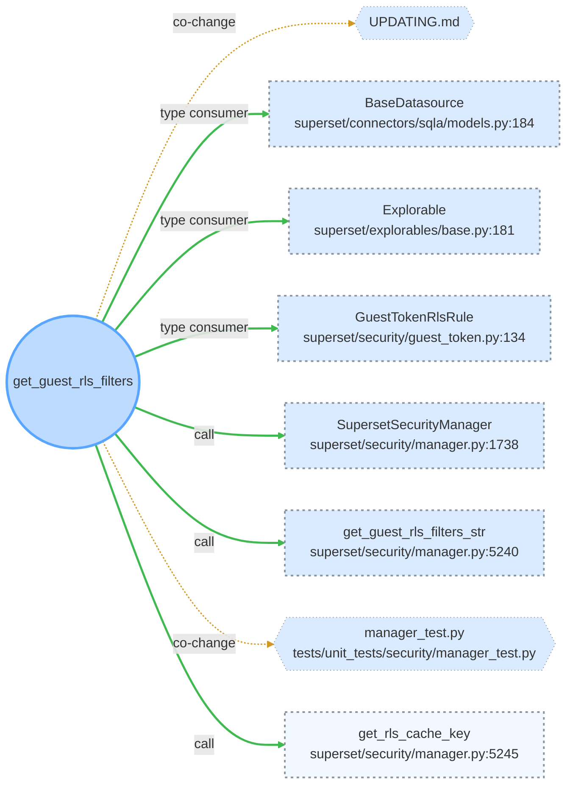

# blastradius

| | |
|---|---|
| Track | 2 — Build with Graph Intelligence |
| Fork | `github.com/ramrajsingh/superset` |
| Branch | **`blastradius`** — `master` is protected on the fork, so all work lands here |
| Entire mirror | `entire://aws-ap-south-1.entire.io/gh/ramrajsingh/superset` (India region) |
| Final commit | tip of `blastradius` — `git log -1 --oneline blastradius` (a commit cannot contain its own hash) |
| Implementation | `tools/blastradius/blastradius.py` |
| Graph evidence | `evidence/` |

## One-sentence summary

Given a change an agent made, blastradius reports what the change actually reaches — and which tests can catch it — by checking the agent's own account of its work against structural evidence from the Entire Graph.

## Problem, intended user and why it matters

The user is whoever has to approve a diff an agent wrote, and whoever owns the CI bill for it.

An agent finishes a change and describes it in its own words: *"refactored the auth middleware, nothing else affected."* A reviewer has no cheap way to check that sentence. The transcript is tens of thousands of tokens; the diff shows three files. Whether the change reaches a security-relevant cache key two call-hops away is exactly what the summary is least likely to mention and the reviewer is least able to see.

The same gap costs money downstream. Not knowing what a change reaches, CI runs everything — on a repo this size that is the difference between a targeted run and a full suite.

So there are two questions with one answer: *what did this change actually touch*, and *which tests can catch it*.

## Selected Entire track and why Entire is essential

**Track 2 — Build with Graph Intelligence.**

Both halves of the product are Entire surfaces, and neither is decoration:

- **Checkpoints supply the claim.** The agent's own summary of what it did is not in the Git diff. Without it there is nothing to check.
- **The Graph supplies the reality.** Callers, type consumers, data flows and co-change relations are what the change reaches. Without it there is nothing to check against.
- **Graph `TESTS` edges supply the test selection.** Coverage becomes a graph relation rather than a filename heuristic.

The report is a set difference:

| Bucket | Meaning |
|---|---|
| Confirmed | The change mentioned it and the graph agrees. |
| **Silent reach** | Reachable from the change, never mentioned. |
| **Unresolved coverage** | Reachable, and the graph found no `TESTS` edge pointing at it. |

Every row in every bucket carries a confidence label, because a graph edge and
the absence of a graph edge are not the same quality of evidence:

| Label | What it means | Gates `--ci` |
|---|---|---|
| `CONFIRMED` | Resolved static relation (`CALLS`, `PARAM_TYPE`, `USES_TYPE`, `RETURNS_TYPE`, `DATA_FLOWS`) whose endpoint file parsed cleanly. | yes |
| `HEURISTIC` | A `FILE_CHANGES_WITH` co-change edge (commit-history correlation, not code), or any endpoint in a file listed in the graph's own `partial_failures`. | no |
| `UNVERIFIED` | An **absence**. The graph found nothing, which is not proof that nothing is there. Printed with the exact command that settles it. | no |

## Architecture and main workflow

```
python tools/blastradius/blastradius.py --symbol <name> [--ref HEAD] [--ci]
```

1. **Reach** — `entire graph impact --symbol S --depth 2 --format json`, reading the `callers`, `type_consumers`, `data_flows` and `co_changes` sections. `callees` is deliberately excluded: those are what the symbol depends on, not what breaks when it changes. Duplicates collapse to the nearest hop so the evidence chain is the shortest one.
2. **Claim** — `entire checkpoint explain`, falling back to the commit message and file list when no checkpoint is linked. The report states which source it used, because they are not equally strong evidence.
3. **Bucket** — confirmed vs. silent, matched on symbol name, qualified name and touched file.
4. **Test selection** — `entire graph neighbors --relation TESTS --direction in` per reachable symbol. A symbol with no incoming edge is reported as *unresolved coverage*, never as untested: the graph missing an edge and the edge not existing are different facts, and only the second is a coverage gap.
5. **Report** — `file:line` and a confidence label on every row, so a reviewer can verify it against source. `--ci` exits non-zero only on `CONFIRMED` reach with unresolved coverage.

### The blast radius as a picture

`--mermaid` renders the same analysis as a diagram. Each variable gets its own
visual channel so none can imply another, and each is encoded twice so no
reading depends on colour alone:

| Variable | Channel | Encoding |
|---|---|---|
| Reach confidence | edge | thick green `==>` CONFIRMED · thin amber `-.->` HEURISTIC |
| Coverage | node border | solid green a `TESTS` edge was found · dashed grey none found · faint dotted not evaluated |
| Blast radius | node fill | alpha by distance — dense at one hop, faint at two |

Fills are alpha over the renderer's own background rather than opaque colours,
so the diagram survives being rendered light or dark. This block is the verbatim
output of `--mermaid` against the live graph, checked byte-for-byte against
`evidence/05-live-mermaid.md`:



- **Edge** — how we know the change reaches it: thick green `==>` CONFIRMED (resolved static relation) · thin amber `-.->` HEURISTIC (co-change, or an endpoint in a file the graph could not parse).
- **Node border** — what we know about tests: solid green a TESTS edge was found · dashed grey no TESTS edge found (unresolved, not a claim of no coverage) · faint dotted coverage not evaluated.
- **Node fill** — blast radius: denser fill is one hop from the change, fainter is two. Distance, not danger — a two-hop reach can matter more than a one-hop one.
- Every variable is encoded twice (weight and hue, dash and hue, alpha), so no reading depends on colour alone. A test file reached by a `TESTS` edge is a purple test node; a test file that merely *co-changes* is a co-change node, because that is the weaker claim.

Node labels carry `file:line`, so the diagram stays as checkable as the table.
Node ids are synthetic (`n0`, `n1`, …) because `.`, `/` and `:` are mermaid parse
errors, and the renderer caps at 40 nodes: a hairball is a worse failure than a
table, so past the cap it draws what it can and says how much it omitted.

**Rendering was verified by rendering, and that mattered.** The diagram has 10
structural tests — node ids, arrow styles, classes, escaping, truncation — and
all of them passed over two bugs that only appeared when the SVG was actually
produced with `mermaid-cli`:

1. `Mod.fn<T>` rendered as **`fn`**. Mermaid parses labels as HTML, so `<T>` was
   consumed as a tag. Valid SVG, no error, characters silently gone.
2. `class n0 covered,hop1` produced the literal class attribute `"covered,hop1"`,
   which matches neither `.covered` nor `.hop1`. Every style rule was emitted
   into the SVG and none of them applied.

Both are the failure mode this project is about: output that looks clean and
quietly is not. Angle brackets are now escaped as numeric entities, and the
class pairs are composed into single classes up front. Each has a regression
test naming how it was found, because neither would have been caught by reading
the grammar.

The rendered SVGs are in `evidence/rendered/`, including the before-and-after
for the swallowed generic:

```
escape-regression-BEFORE-fix.svg   <p>fn<br />c/d.py:12</p>
escape-regression.svg              <p>fn&lt;T&gt;<br />c/d.py:12</p>
```

Rendering is pure — it never queries the graph. With `--from-json` it replays a
saved payload, so the whole run is offline:

```bash
python tools/blastradius/blastradius.py --symbol get_guest_rls_filters \
    --from-json evidence/02-impact-before-change.json --no-tests --mermaid
```

Claim extraction is deliberately structural — only code-shaped tokens count as a claim — so the tool makes **no model call and needs no network or API key**. That was a design decision, not an omission: a review tool that cannot run offline cannot run in CI.

## Entire Graph findings and verification

**1. Definition lookup** — `evidence/01-definition.json`

```
entire graph def get_guest_rls_filters --repo . --format json
```

Resolved `SupersetSecurityManager.get_guest_rls_filters`, `superset/security/manager.py:5033-5049`, kind `method`.

**2. Impact analysis before a high-risk change** — `evidence/02-impact-before-change.json`

```
entire graph impact --symbol get_guest_rls_filters --repo . --depth 2 --format json
```

Row-level security for embedded dashboards. The analysis returned:

```
d1 CALLS         SupersetSecurityManager.get_guest_rls_filters_str   manager.py:5240
d2 CALLS         SupersetSecurityManager.get_rls_cache_key           manager.py:5245
d1 RETURNS_TYPE  GuestTokenRlsRule                                   guest_token.py:134
d1 PARAM_TYPE    BaseDatasource                                      models.py:184
d1 PARAM_TYPE    Explorable                                          explorables/base.py:181
```

`get_rls_cache_key` at depth 2 is the finding that matters: change what the RLS filters mean and the **cache key** is downstream, so the same key can serve rows scoped to a different tenant.

**3. Verification — where the graph was incomplete, and how we knew**

Grep finds call sites the graph does not report, at `superset/jinja_context.py:297` and `superset/connectors/sqla/models.py:891`. Both reach the function through a module-level `security_manager` singleton, so dynamic dispatch defeats static attribution.

We treated this as the guide instructs — evidence, not an oracle — and it changed the product: the report surfaces the graph's own `partial_failures` (32 files parsed with syntax errors when first measured, 33 at submission) instead of presenting a clean-looking result as fact. The Curveball then pushed that from a footer down onto the individual row, and turned this specific gap into the standing `UNVERIFIED` note the tool prints on every run.

Re-verified at submission time:

```
$ grep -rn "get_guest_rls_filters" superset/ --include='*.py'
superset/jinja_context.py:297:      for rule in security_manager.get_guest_rls_filters(self.table)
superset/connectors/sqla/models.py:891: for rule in security_manager.get_guest_rls_filters(self):
```

**4. Semantic diff of the Curveball change** — `evidence/04-semantic-diff.json`

```
entire graph diff --base c2ef90bff2 --head HEAD --json
```

Symbol-level, not line-level, across the whole Curveball response. It names the
25 changed symbols in `blastradius.py` — `Symbol.display_name`, `Reach`,
`Coverage`, `Coverage.confidence`, `Impact`, `classify_reach`, `parse_impact`,
`graph_impact`, `select_tests`, `gating_rows`, `coverage_verify`, `mermaid`,
`mermaid_node`, `mermaid_escape`, `mermaid_block` among them — and the 25 added
in `test_blastradius.py`. That is the confidence model as a diff: three new
types, one new classifier and one renderer, with the existing pipeline functions
rewired rather than replaced.

**5. Live verification run** — `evidence/03-with-test-selection.txt`

```
python tools/blastradius/blastradius.py --symbol get_guest_rls_filters --ci   # exit 1
```

Eight reachable, six with no `TESTS` edge found, all six labelled `UNVERIFIED`
with `reach CONFIRMED`, so the gate fires. Two rows came back `HEURISTIC`
(co-change) and are reported without gating. The completeness note reads *"0 in
Python (the analysed language); 34 elsewhere (YAML 26, JSON 4, TypeScript 4)"* —
so nothing was downgraded for a parse failure, and the run proves the
fully-resolved path is untouched on real data rather than only in a fixture.

## Noon Curveball: what changed and how we adapted

**The card, verbatim:** *"Graph is evidence, not an oracle."* Required: must not
present incomplete graph relationships as certain; must identify when analysis
may be partial; must provide a safe fallback or verification path; existing
behaviour for fully-resolved code must keep working; must include a test or
fixture representing incomplete analysis.

**The assumption it attacked.** Our report had one voice for every row. A
`CALLS` edge the graph resolved by reading the source and a `FILE_CHANGES_WITH`
edge inferred from two commits printed identically, and "no `TESTS` edge" printed
as *untested reach* — an absence stated as a fact. The tool was already warning
about `partial_failures` in a footer, which is the honest instinct in the wrong
place: a global warning does not tell you *which row* to distrust.

**Reconstruction.** Fresh session, no prior context. Recovered from checkpoint
`01M1TPKG7TYGQCJB01DH20TMF9` (commit `c2ef90b`) via `entire checkpoint explain`,
which carried the architecture, the decision to gate on coverage rather than on
reach, and the dynamic-dispatch gap we had already found.

**Impact analysis before the change** — `evidence/impact_graph_impact.json`,
`evidence/impact_select_tests.json`

```
entire graph impact --symbol graph_impact --repo . --depth 2 --format json
entire graph impact --symbol select_tests --repo . --depth 2 --format json
```

These are the two functions that consume relationship evidence, so they are what
a confidence change touches. The graph named `main` as the only caller of each,
and `Reach` / `Symbol` as the type consumers — `select_tests` at depth 1 through
`RETURNS_TYPE`, `USES_TYPE` and `PARAM_TYPE`. That is what made changing its
return type from `tuple[dict, list[Symbol]]` to `list[Coverage]` a bounded edit
rather than a guess: two call sites in `main`, one new type, nothing else.

**What changed**

- `parse_impact()` split out of `graph_impact()` as a pure function, so a saved
  payload can be replayed without the graph. This is what makes the fixture test
  possible.
- `classify_reach()` labels every edge. The `partial_failures` check runs *first*:
  a `CALLS` edge is only as good as the parse of the file it points into, so an
  endpoint in an unparsed file is `HEURISTIC` however structural the relation is.
- `Coverage` carries two independent confidences — how we know the change reaches
  the symbol, and what we know about tests for it.
- Absences are worded as absences: *"no TESTS edge found — unresolved, verify
  manually"*, with `grep -rn <name> tests/` and `pytest -k <name>` printed per row.
  Downgraded reach rows print their own check: `grep` for a code claim,
  `git log --oneline -10 -- <file>` for a co-change claim, because a claim about
  commit history is settled by commit history.
- The completeness note is scoped to the analysed language instead of totalled.
  In this repo all 33 parse failures are YAML, TypeScript and JSON while the
  analysis is Python, so the report says so and downgrades nothing — a global
  "degraded" banner over a clean Python result would be its own kind of lying.
- A standing `UNVERIFIED` footer names the dynamic-dispatch gap with its measured
  case, so the limit ships with the output rather than living in a README.

**What stayed.** Bucketing, ordering, `file:line`, the pytest command, and the
exit codes are untouched. `test_reach_ordering_and_locations_are_unchanged` and
`test_a_clean_payload_downgrades_nothing` pin that: with no `partial_failures`,
every static relation still labels `CONFIRMED` and no completeness note prints.

**The safe fallback.** `--ci` gates only on `CONFIRMED` reach with unresolved
coverage. Co-change reach, endpoints in unparsed files, and `TESTS` queries that
errored are reported and never fail a build.

One judgement call worth stating, because the card admits two readings. "No
`TESTS` edge" is an absence, so it is always `UNVERIFIED`; read strictly, *"never
gate on UNVERIFIED"* would make `--ci` inert. We key the gate on the **reach**
confidence — the graph resolved the path from the change to the symbol, and then
found nothing attached to it — and the gate's own message says exactly that
rather than claiming those symbols are uncovered. Failing a build on evidence we
would not defend in review is how a gate gets disabled.

**The test.** `tools/blastradius/test_blastradius.py`, against the saved payload
`tools/blastradius/fixtures/impact_partial_failures.json`, which contains a
`CALLS` edge into `superset/connectors/sqla/models.py` while that same file is
listed in `partial_failures` — the incomplete-analysis case, taken from the real
shape of `entire graph impact` output.

```
$ pytest tools/blastradius/test_blastradius.py -q
..........................                                               [100%]
26 passed
```

`test_missing_tests_edge_is_reported_as_unresolved_not_as_untested` asserts the
rendered report contains *"no TESTS edge found — unresolved, verify manually"*
and that the strings `untested` and `not covered` appear nowhere in it. The
wording is pinned by a test, not by discipline.

## Checkpoint links and what each checkpoint proves

All checkpoints are on branch `blastradius` and synced to the mirror.

| # | Milestone | Checkpoint | Commit | What it proves |
|---|---|---|---|---|
| 1 | Initial understanding and intended architecture | `01M1TP1KQMM23MXEHZ1FF0W9X8` | `611b59e` | The claim-vs-reality thesis and the first working end-to-end path: checkpoint → graph impact → three buckets. |
| — | Scope extension: test selection | `01M1TPHAQVCNN0GMAAQ8KKQ49Q` | `2cc4b80` | Deciding that reach should name the tests that can catch it, using graph `TESTS` edges rather than filename heuristics. |
| 2 | Last stable state before the Noon Curveball | `01M1TPKG7TYGQCJB01DH20TMF9` | `c2ef90b` | Architecture, graph findings, and the dynamic-dispatch gap we had already found — the state the fresh session reconstructed from. |
| 3 | Response to the Noon Curveball | `01M1TRTV1FTYDMXE39EFZZ1DY4` | `d16db0c` | Confidence labelling: the three tiers, the `partial_failures` downgrade, absences worded as absences, and `--ci` gating only on `CONFIRMED` reach. Reconstructed from checkpoint 2 in a fresh session with no prior context. |
| 4 | Final implementation and verification | _see `git log`_ | _`HEAD`_ | The mermaid renderer and `--from-json` offline replay, plus the live verification run and the semantic diff of the whole Curveball change. |

**Honest note on checkpoint history:** our first commits were made by hand, outside an agent session, so no checkpoint was captured — Entire records agent sessions, and a bare `git commit` has nothing to record. We found this by checking `git for-each-ref refs/entire/checkpoints` and finding it empty, then re-ran the work through an agent session. The checkpoints above are therefore later than the work they describe, and we would rather say so than present a tidy history.

## Setup, run and test instructions

```bash
# from the repo root, with the graph plugin installed
entire plugin install graph

python tools/blastradius/blastradius.py --symbol get_guest_rls_filters
python tools/blastradius/blastradius.py --symbol get_guest_rls_filters --ci
python tools/blastradius/blastradius.py --symbol X --no-tests   # faster, skips test selection
python tools/blastradius/blastradius.py --symbol X --mermaid    # diagram instead of the table

# Offline: replay saved evidence, no graph query and no index build
python tools/blastradius/blastradius.py --symbol get_guest_rls_filters \
    --from-json evidence/02-impact-before-change.json --no-tests --mermaid

pytest tools/blastradius/test_blastradius.py   # 26 tests, no graph needed
```

Exit codes: `0` nothing to flag · `1` findings (or, with `--ci`, untested reach) · `2` the graph could not answer.

**Performance note for reviewers:** the first query against a repo this size builds the index — measured at 276s here, with query latency of 79ms once warm. Any edit to the working tree invalidates that cache, so batch edits and query once.

## Databricks use, data sources and limitations (if applicable)

**Category opt-in is not decided** — the assets below exist and run, but nothing
has been deployed to a Databricks workspace and we have not entered the Best Use
of Databricks category.

`databricks/` holds the graph as a dataset plus a notebook that reads it:

| Asset | Contents |
|---|---|
| `data/graph_nodes.csv` | 15 symbols — id, qualified name, kind, `file:line`, language |
| `data/graph_edges.csv` | 15 edges across three analysed symbols — relation, depth, confidence, downgrade reason |
| `data/graph_partial_failures.csv` | 95 rows of what the graph could not parse, by focus |
| `blastradius_graph_viz.py` | Databricks notebook: reach by confidence, blast radius by distance, a NetworkX drawing, the parse-failure breakdown, and the CLI's own mermaid via `displayHTML` |

The notebook is a **single-file import**: it reads the CSVs when it can reach
them (Spark first, then local pandas) and otherwise falls back to a copy of the
125 rows embedded in the file, printing which source it used — a stale embedded
copy and a fresh CSV are not the same evidence. Nothing has to be uploaded
first.

The notebook uses the same encoding as the CLI diagram — edge colour is reach
confidence, node alpha is distance — so the two views are one analysis rather
than two implementations that can drift.

**Verified by running it**, with `dbutils`, `display` and `displayHTML` stubbed
and Spark absent so the pandas fallback is exercised: all seven code cells
execute against the real CSVs. Rendered figures are in
`evidence/rendered/notebook-fig*.png`.

**Limitations, which are the dataset's and not the notebook's:**

- **No `UNVERIFIED` rows.** An absence in an edge table reads as a fact. "No `TESTS` edge found" stays in the CLI, where it ships with the command that settles it.
- **Undercounts reach.** The dynamically-dispatched callers at `superset/jinja_context.py:297` and `superset/connectors/sqla/models.py:891` carry no `CALLS` edge, so they are absent from `graph_edges.csv`. Any aggregate over these rows is a lower bound.
- **Confidence is not severity.** It says how well we know an edge exists, not how much it should worry you.
- Three analysed symbols, depth 2 — a demonstration slice, not a repository-wide export.

## Known limitations and next steps

**Limitations**

- Static call attribution misses dynamic dispatch. Documented above with a concrete case; the report warns rather than claiming completeness.
- Claim extraction is structural, not semantic. A symbol described in prose but never named ("the caching layer") is not credited as claimed, so it can appear as silent reach.
- Test selection is only as good as the graph's `TESTS` edges; a test that exercises code through a fixture chain may not be attributed.
- Reach is capped at depth 2, which is the maximum `entire graph impact` accepts.
- Confidence is a property of the *edge*, not of the finding's importance. A `HEURISTIC` co-change row can matter more than a `CONFIRMED` type-consumer row; the label says how well we know it, not how much it should worry you.
- The `partial_failures` downgrade is file-granular. A file that fails to parse at line 12 downgrades every endpoint in it, including symbols the parser read perfectly well.
- `--ci` gating on `CONFIRMED` reach means a genuine coverage gap reached only through dynamic dispatch will not fail the build. That is the deliberate trade: the gate is quiet where the evidence is weak, and the `UNVERIFIED` rows carry the commands to check it by hand.
- The diagram encodes three variables and stops there. A fourth — relation kind, say — would need a channel that does not exist without hurting legibility, so relation kind stays on the edge label as text.
- `linkStyle` is index-based, so edge colouring is only correct because the renderer emits the edges itself. Hand-editing the generated mermaid will silently mis-colour edges.
- Diagram styling is verified by rendering with `mermaid-cli`, which is a dev-time dependency, not a runtime one. The tool itself emits text and never shells out to render.

**Next steps**

- Run in CI on every agent-authored commit, gated on untested reach — `--ci` and the exit codes already exist for this.
- Post the report as a PR comment before a human opens the diff — the mermaid block renders inline on GitHub, so the diagram costs nothing extra to ship.
- Emit the selected tests as a CI job matrix, so the saving is realised rather than just reported.
- Expose the same report as a tool an agent can call, so the check happens before the change is written rather than after.
- Add the `mermaid-cli` render to CI as a golden-image check, so a future styling change cannot silently stop applying the way `class a,b` did.
