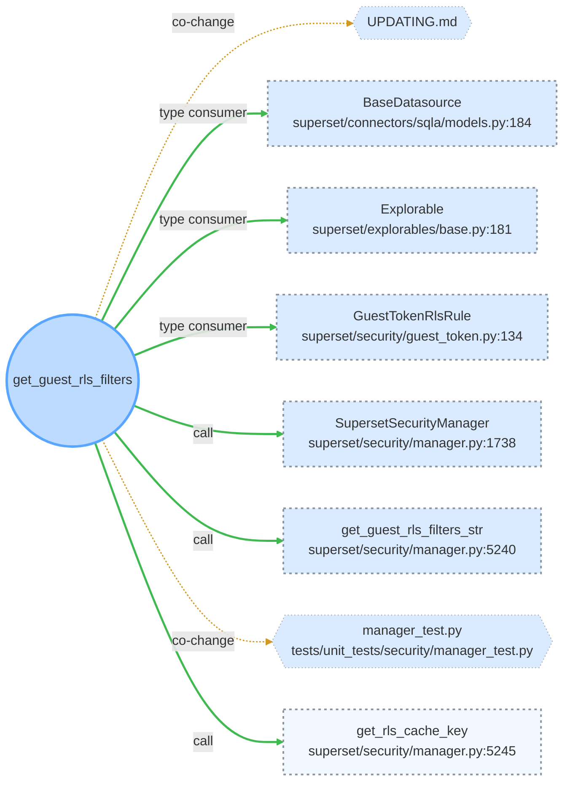

- **Edge** — how we know the change reaches it: thick green `==>` CONFIRMED (resolved static relation) · thin amber `-.->` HEURISTIC (co-change, or an endpoint in a file the graph could not parse).
- **Node border** — what we know about tests: solid green a TESTS edge was found · dashed grey no TESTS edge found (unresolved, not a claim of no coverage) · faint dotted coverage not evaluated.
- **Node fill** — blast radius: denser fill is one hop from the change, fainter is two. Distance, not danger — a two-hop reach can matter more than a one-hop one.
- Every variable is encoded twice (weight and hue, dash and hue, alpha), so no reading depends on colour alone. A test file reached by a `TESTS` edge is a purple test node; a test file that merely *co-changes* is a co-change node, because that is the weaker claim.

